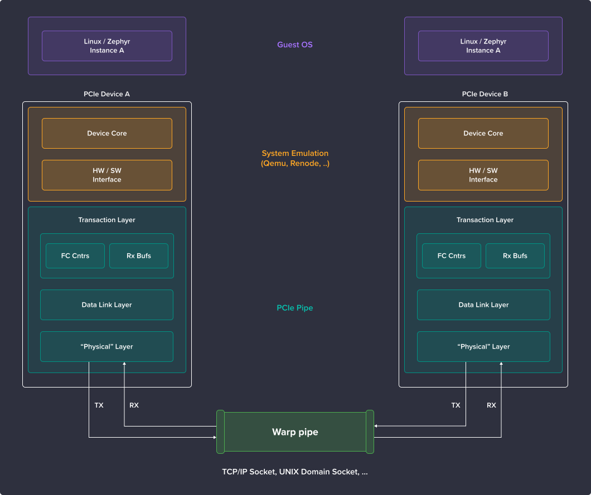

# Introduction

Warp Pipe is a library (refered to as "warp-pipe") and a tool allowing you to create PCIe links in a distributed simulation environment.

This includes:

* packetizing/depacketizing PCIe transactions into PCIe Data Link-Layer Packets (DLLPs) and PCIe Transaction Layer Packets (TLPs)
* transmitting PCIe transactions over sockets using a custom PCIe/IP TCP-based protocol
* creating PCIe links between instances of different simulators/emulators (e.g. Renode and QEMU) and operating systems (e.g. Zephyr)
* handling MSIs, packet routing and flow control

The structure of the Warp Pipe-oriented flow can be visualized in a ISO-style stack format:

This document covers Warp Pipe itself, its usage and companion utilities, like Wireshark PCIe dissector.

## Structure of the repository

The repository is organized as follows:

- `.github/workflows` - GitHub Actions CI configuration
- `docs` - directory hosting this documentation
- `inc/warppipe` - header files for warp-pipe
- `memory-mock` - sample application simulating a PCIe memory
- `qemu` - submodule with warp-pipe fork of QEMU
- `scripts` - additional scripting to report test coverage
- `src` - warp-pipe sources
- `tests` - unit tests for warp-pipe
- `zephyr` - Zephyr RTOS configuration to enable using warp-pipe as a Zephyr module
- `zephyr-samples` - a range of Zephyr RTOS tests, targeting either the `native_sim` target or a target to be run in a simulator
- `zephyr-tests` - a directory with tests runnable via Zephyr Twister
