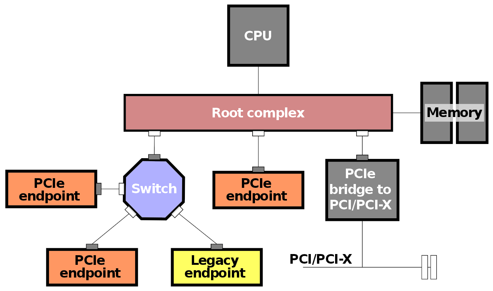

# PCI Express

PCIe is based on point-to-point topology. Devices are connected to the root
complex (PCIe host) through separate full-duplex serial links. If PCIe devices
are not directly connected to the root complex, they can be indirectly
connected through a PCIe switch.

:::{figure-md} pcie-topology


PCI Express topology. [Mliu92 CC BY-SA 4.0](https://en.wikipedia.org/wiki/File:Example_PCI_Express_Topology.svg)
:::

## Physical Layer

```{note}
The Warp Pipe emulation PCIe communication library will not have to concern
itself with the PHY layer. Please treat this section as a supplementary one.
```

System Management Bus (SMBus) is used for controlling and managing PCIe
devices. It is interoperable, to some extent, with I2C. PCIe uses serial
interface.

The standard way to declare how many datalanes are supported is by the `nx`
notation, e.g. `1x` supports one data lane, `2x` - two data lanes, and `4x` - four
data lanes. Data lanes use Low Voltage Differential Signaling (LVDS).

Mechanical key notch is used to separate control and power pins from data pins.

PCIe uses 8b/10b encoding (<3.0) or 128b/130b (3.0 onwards). Data clock is
embedded in the serial signal. Interrupts are signalled through Message
Signaled Interrupts (MSI). MSI-X are used in PCIe 3.0 onwards.

## Data Link Layer

Data link layer packets (DLLPs) can be divided into four categories:

* ACK DLLPs - for acknowledging that Transaction Layer Packet (TLP) was successfully received
* NAK DLLPs - for informing that the TLP was corrupted or that timeout occurred
* Flow control (FC) DLLPs - used to announce credits
* Power management DLLPs

```{note}
Warp Pipe will not have to handle power management DLPPs, as the
assumption is that all PCIe devices will be emulated.
```

The FC mechanism accounts for 6 buffer consumers (credit types):
* Posted Requests TLP headers
* Posted Requests TLP data
* Non-Posted Requests TLP headers
* Non-Posted Requests TLP data
* Completion TLP headers
* Completion TLP data

## Transaction Layer

Transaction Layer Packets (TLPs) carry the actual read/write operation requests
to/from a PCIe device.

TLPs may target one of the following address spaces:
* Memory
* IO
* Configuration
* Message

Transactions can be "posted" or "non-posted", which indicates if a request requires a completion or not.

Posted transactions, namely memory writes and messages, are considered "finished" by the issuer as soon as they are sent,
which has the potential of increasing the performance of the system.

Completion messages, indicating if the transaction is finished, may or may not contain data.
