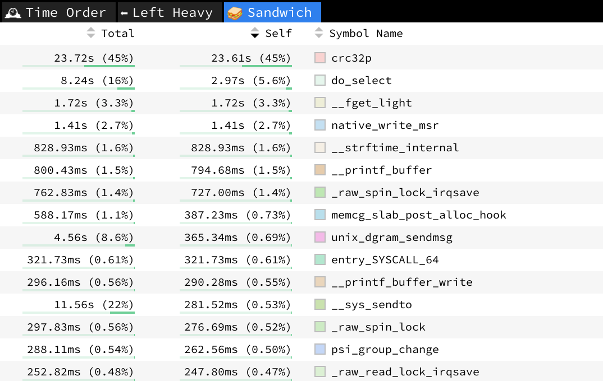
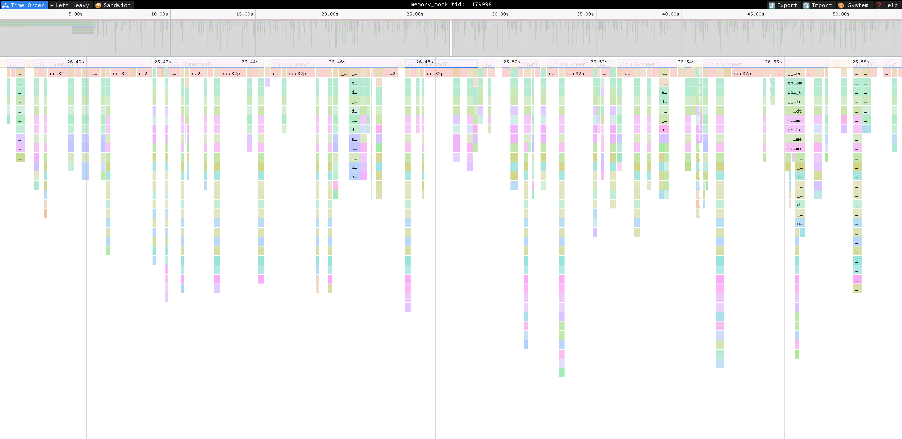

# Warp Pipe performance analysis

To verify performance and identify bottlenecks of Warp Pipe implementation we have created a Zephyr-based sample based on the `native_sim` target.

The sample creates 506 threads (as proved to perform stable on a regular PC) and issues 100 transactions per thread.

Each iteration reads 2048 bytes of data, writes it back and then reads it again.

The whole process takes 21 seconds of native_sim time (49s of real time).

## Testing plan

Performance analysis should take several points into account:

1. verification of the impact of a number of threads,
2. verification of the flow of multiple single-threaded Zephyr instances,
3. verification of various payload sizes,
4. verification of various number of iterations per thread.

Currently the testing flow allows to verify different values for scenarios 1, 3 and 4.

## Bottleneck analysis

Analysis of potential bottlenecks has to take into account the results of performance analysis, so that the focus is not misplaced on scenarios that are not in need for improvement.

To gather information about most time-consuming issues, we can use the `perf` tool.

First, compile `memory-mock` and start it as a background process.
The PID of the process will be used to start up `perf`.

Before running the process, ensure your system will allow you to gather trace data, by running as root:

```
echo -1 >! /proc/sys/kernel/perf_event_paranoid
```

After that you can start `memory-mock`:
```
./build_memory_mock/memory_mock &
```

Next, connect `perf` to the running process:
```
perf record -a -F 999 -g -p $!
```

With the `memory-mock` set up, you can spawn the Zephyr application:

```
./build.pcie_native_thread/zephyr/zephyr.exe
```

The application will print the following output:
```
*** Booting Zephyr OS build f89c5ddd1aaf ***
[00:00:00.000,000] <inf> pcie_native: Started app
[00:00:00.000,000] <inf> pcie_native: Started client
[00:00:00.000,000] <inf> pcie_native: Registering bar 0 at 0x100000 (size: 128)
[00:00:00.000,000] <inf> pcie_native: Registering bar 1 at 0x140000 (size: 2048)
[00:00:21.000,000] <inf> pcie_native: Done!
```

When the `Done` message is printed out, stop the `perf` process with `Ctrl+C`.

The last step is to convert `perf` results to a readable format:

```
perf script -i perf.data > perf.script
```

The results, while easily readable, are better presented in a form of flame graph, e.g. with the [Speedscope](https://www.speedscope.app/) tool:

```
speedscope perf.script
```

Initial analysis, through the so-called "Sandwich" view, points to the implementation of CRC32 as a potential target of optimization process.



