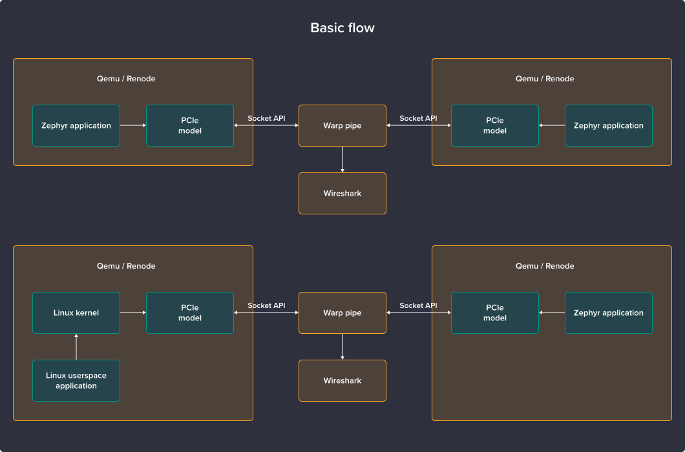
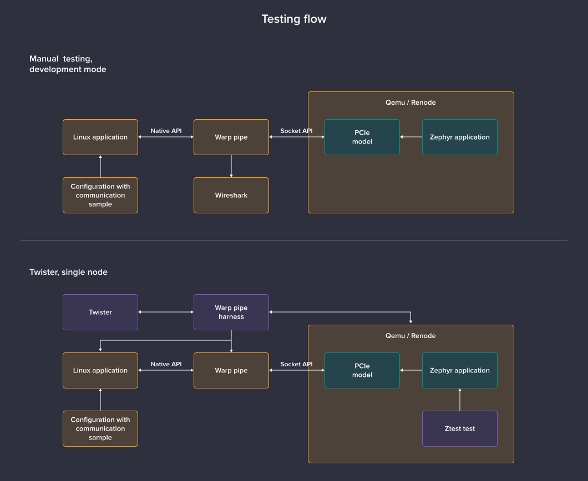

# Warp Pipe usage examples

Warp Pipe can be used in various different contexts:

* directly with host applications, mocking PCIe devices
* linked with operating systems like Zephyr
* connected to simulation tools, intercepting PCIe traffic

Typical target usage will consist of two operating systems, running in virtualized/simulated environments, communicating over Warp Pipe running on host, as can be exemplified by the following graphs:



Apart from employing Warp Pipe for node-to-node communication, it can also be used to automate testing of APIs and protocols over PCIe, with one endpoint running in a simulated environment and the other one in a custom application on host, prepared specifically for the purpose of the test and exercising a desired test scenario.

These tests can also be orchestrated via Zephyr's Twister and a custom Warp Pipe harness:



To exemplify these various use cases, the Warp Pipe repository comes with a range of samples and tests.

(memory-mock)=
## Memory mock

The `memory-mock` application uses `warp-pipe` library and acts as simple PCIe device that emulates memory.

It's used as an endpoint for several tests and in itself is a good example of the warp-pipe API usage.

Before building, ensure that `warp-pipe` [is properly installed and accessible](#basics) and that the `PKG_CONFIG_PATH` variable is set if needed.

To build `memory-mock`, run the following commands:

```
mkdir -p build_memory_mock
cmake -S memory-mock -B build_memory_mock
make -j $(nproc) -C build_memory_mock
```

To launch the `memory-mock`, use:
```
./build_memory_mock/memory_mock
```

Keep in mind that Twister tests expect `memory-mock` to be accessible in the aforementioned directory.

## PCIe Pipe

Requirements:
* [warp-pipe](#basics)
* [QEMU](#qemu)
* [Zephyr](#zephyr-setup)

This sample is located in `zephyr-samples/pcie-pipe` and allows you to connect two Zephyr instances, one working as a server, one as a client. It relies on the QEMU ``warp-pipe`` device to handle communication between two nodes.

You need to build the sample in two configurations:

```
west build -d build.pcie_pipe_server/ -b qemu_x86_64 zephyr-samples/pcie_pipe/ -- -DWarpPipeConnection=listen
west build -d build.pcie_pipe_client/ -b qemu_x86_64 zephyr-samples/pcie_pipe/ -- -DWarpPipeConnection=connect
```

After building, run the two targets in separate windows for clarity.

First, start the server:
```
west build -t run -d build.pcie_pipe_server/
```

Then, spawn the client:
```
west build -t run -d build.pcie_pipe_client/
```

The client will generate the following output:
```
Initial memory values:
0x3020100 0x7060504 0xb0a0908 0xf0e0d0c 0x13121110 0x17161514 0x1b1a1918 0x1f1e1d1c
0x23222120 0x27262524 0x2b2a2928 0x2f2e2d2c 0x33323130 0x37363534 0x3b3a3938 0x3f3e3d3c
0x43424140 0x47464544 0x4b4a4948 0x4f4e4d4c 0x53525150 0x57565554 0x5b5a5958 0x5f5e5d5c
0x63626160 0x67666564 0x6b6a6968 0x6f6e6d6c 0x73727170 0x77767574 0x7b7a7978 0x7f7e7d7c
Updated memory values:
0xabababab 0xabababab 0xabababab 0xabababab 0xabababab 0xabababab 0xabababab 0xabababab
0xabababab 0xabababab 0xabababab 0xabababab 0xabababab 0xabababab 0xabababab 0xabababab
0xabababab 0xabababab 0xabababab 0xabababab 0xabababab 0xabababab 0xabababab 0xabababab
0xabababab 0xabababab 0xabababab 0xabababab 0xabababab 0xabababab 0xabababab 0xabababab
Allocated 1 vectors
1 MSI-X Vectors connected
Received MSI-X IRQ!
Received MSI-X IRQ!
```

Stop both samples with `Ctrl-C`.

## PCIe Native

Requirements
* [warp-pipe](#basics)
* [memory-mock](#memory-mock)
* [Zephyr](#zephyr-setup)

This sample, located in `zephyr-samples/pcie_native`, presents communication between `memory-mock` and Zephyr compiled for the `native_sim` target.

First, build Zephyr:
```
west build -p -d build.pcie_native -b native_sim zephyr-samples/pcie_native
```

After that, launch `memory-mock`:
```
./build_memory_mock/memory_mock
```

As the last step, launch Zephyr:
```
./build.pcie_native/zephyr/zephyr.exe
```

Expect the following output:
```
*** Booting Zephyr OS build f89c5ddd1aaf ***
[00:00:00.000,000] <inf> pcie_native: Started app
[00:00:00.000,000] <inf> pcie_native: Started client
[00:00:00.000,000] <inf> pcie_native: Registering bar 0 at 0x100000 (size: 128)
[00:00:00.000,000] <inf> pcie_native: Registering bar 1 at 0x140000 (size: 1024)
Read data (len: 16): 10 11 12 13 14 15 16 17 18 19 1a 1b 1c 1d 1e 1f
Read data (len: 16): 00 00 00 00 00 00 00 00 00 00 00 00 00 00 00 00
Read data (len: 16): 68 65 6c 6c 6f 00 00 00 00 00 00 00 00 00 00 00
[00:00:00.000,000] <inf> pcie_native: The next read should fail
[00:00:00.000,000] <err> pcie_native: Failed to read bar 2 at addr 0-0
[00:00:00.000,000] <inf> pcie_native: All checks has succeded.
```

## PCIe DMA

Requirements:
* [warp-pipe](#basics)
* [memory-mock](#memory-mock)
* [Zephyr](#zephyr-setup)

The PCIe DMA sample is available in `zephyr-samples/pcie_dma`.

This sample uses a modified [`dma_emul`](https://github.com/antmicro/warp-pipe/blob/main/zephyr-samples/drivers/dma/dma_emul.c) driver to perform DMA transactions between Zephyr and `memory-mock`.

Zephyr starts by configuring the DMA transaction, setting the source to the remode memory and target to its own local space. Then it issues a transaction that copies data from `memory-mock`. 

`dma-emul` was adapted to use the warp-pipe API directly, so it needs to be compiled for the `native_sim` target.

First, build the sample:
```
west build -p -d build.pcie_dma -b native_sim zephyr-samples/pcie_dma/
```

Then start the `memory-mock`:
```
./build_memory_mock/memory_mock
```

Lastly, run Zephyr:
```
./build.pcie_dma/zephyr/zephyr.exe
```

Expect the following output:
```
Data transfer finished: 0x10 0x11 0x12 0x13 0x14 0x15 0x16 0x17 0x18 0x19 0x1a 0x1b 0x1c 0x1d 0x1e 0x1f 0x20 0x21 0x22 0x23 0x24 0x25 0x26 0x27 0x28 0x29 0x2a 0x2b 0x2c 0x2d 0x2e 0x2f
```

