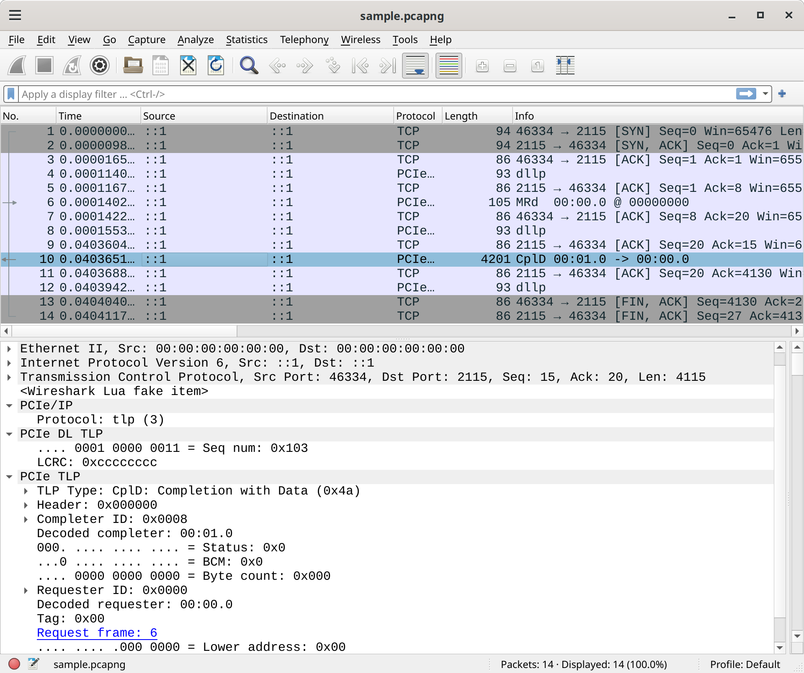

# Wireshark

You can install [the plugin][wireshark-plug] by simply copying it to `$XDG_CONFIG_HOME/wireshark/plugins` (`~/.config/wireshark/plugins` on Linux).
The directory may not exist yet.

```
mkdir -p ~/.config/wireshark/plugins
cd ~/.config/wireshark/plugins
wget https://raw.githubusercontent.com/antmicro/wireshark-pcie-dissector/main/pcie-pipe.lua
cd -
```

Currently the plugin features a simple dissector for the protocol described in [the "Wire format" section](#wire-format).

Typically, to analyze Warp Pipe traffic using Wireshark, you will open it to listen to your loopback interface.

The [plugin repository][wireshark-plug-repo] contains a sample PCAPNg file you can open with Wireshark do test the plugin functionality:

```
wget https://github.com/antmicro/wireshark-pcie-dissector/raw/main/sample.pcapng
wireshark sample.pcapng
```

:::{figure-md} wireshark


Wireshark with plugin properly installed
:::

You can also use a CLI tool to verify the plugin installation:

```
$ tshark -r sample.pcapng pcie

    4 0.000114094          ::1 → ::1          PCIe/IP 93 dllp
    6 0.000140261          ::1 → ::1          PCIe/IP 105 MRd  00:00.0 @ 00000000
    8 0.000155321          ::1 → ::1          PCIe/IP 93 dllp
   10 0.040365125          ::1 → ::1          PCIe/IP 4201 CplD 00:01.0 -> 00:00.0
   12 0.040394209          ::1 → ::1          PCIe/IP 93 dllp
```


[wireshark-plug]: https://github.com/antmicro/wireshark-pcie-dissector/blob/main/pcie-pipe.lua
[wireshark-plug-repo]: https://github.com/antmicro/wireshark-pcie-dissector/
